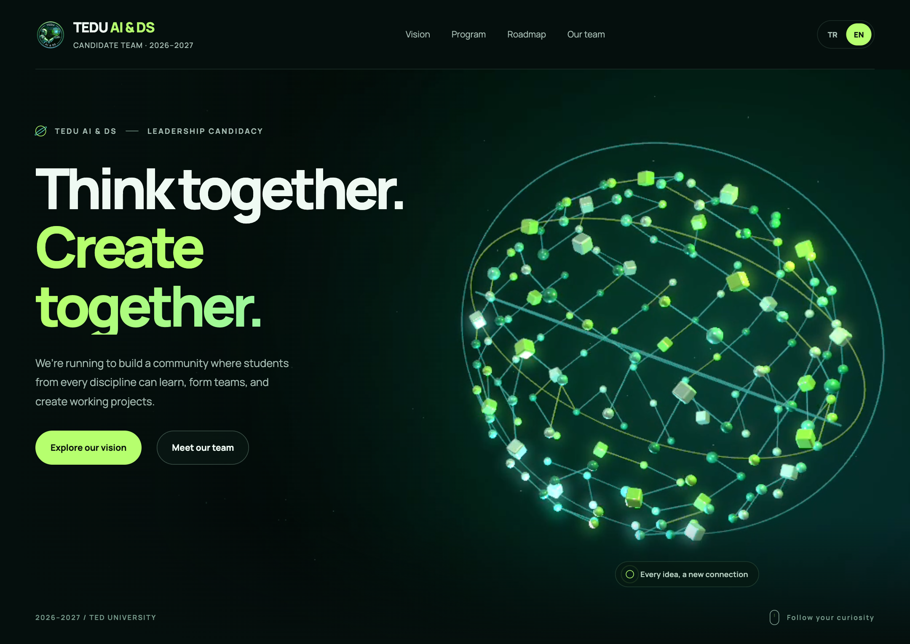

<p align="center">
  
</p>

<p align="center">
  <strong>Curiosity becomes a project. A project becomes shared value.</strong><br />
  An animated bilingual website for our TED University AI & Data Science leadership candidacy.
</p>

<p align="center">
  <a href="https://ilkeozcendek.github.io/tedu-ai-ds-website/?lang=tr"><strong>Visit website · TR</strong></a> &nbsp; · &nbsp;
  <a href="https://ilkeozcendek.github.io/tedu-ai-ds-website/?lang=en"><strong>EN</strong></a> &nbsp; · &nbsp;
  <a href="#the-experience">Explore the project</a> &nbsp; · &nbsp;
  <a href="#run-locally">Run locally</a> &nbsp; · &nbsp;
  <a href="#türkçe">Türkçe</a>
</p>

<p align="center">
  <code>HTML</code> &nbsp; <code>CSS</code> &nbsp; <code>JavaScript</code> &nbsp; <code>Canvas</code> &nbsp; <code>SVG</code>
</p>

---

## The experience

A presentation of our **2026–2027 candidate team** and the community we want to build through shared projects. Forest green, lime and teal carry through an interface designed to feel alive before you touch anything.

This is a candidacy presentation. Activities, visits and collaborations describe our proposals; they are subject to planning and relevant approvals.

<p align="center">
  
</p>

| Detail | Inside the page |
| :--- | :--- |
| **Two languages** | Turkish and English, remembered preferences and direct `?lang=tr` / `?lang=en` links. |
| **Motion with purpose** | A silent desktop video and a mobile Canvas scene that animates without video autoplay permission. |
| **From idea to demo** | Four animated SVG scenes: bring an idea, find your team, test and build, share your work. |
| **Made for touch** | Optional sideways swipes, previous/next controls, mobile bottom navigation and a section menu. |
| **A fuller story** | Learning paths, interdisciplinary ideas, a yearly roadmap and ten candidate team members. |
| **Considered interaction** | Keyboard navigation, visible focus, scroll reveals and reduced-motion support. |

## Run locally

No dependencies or build step. With Python 3 installed:

```bash
git clone https://github.com/IlkeOzcendek/tedu-ai-ds-website.git
cd tedu-ai-ds-website
python3 -m http.server 8000
```

Open [Turkish](http://localhost:8000/?lang=tr) or [English](http://localhost:8000/?lang=en). Stop the server with `Ctrl+C`.

## Make it your own

Page content and paired `data-tr` / `data-en` translations live in `index.html`. Keep both versions updated when editing copy.

```text
index.html             Content, translations and SVG scenes
app.js                 Language, tabs, filters and core interactions
interaction.js         Mobile navigation, touch and scroll behavior
hero-ambient.js         Mobile Canvas animation
journey.js              Four-stage journey controls
*.css                  Layout, visual details and animation
assets/                Emblem, video, poster and local fonts
docs/                  README artwork and preview
```

For static hosting, publish this folder with `index.html` at the site root and preserve the relative file paths. The site requires no backend, API keys, or environment variables.

## Design & development

**Built with AI assistance using OpenAI Codex.** I supplied the candidacy content, directed the visual design, reviewed the results and refined the experience through repeated feedback. This project grew through an AI-assisted “vibe-coded” workflow. The focus was on motion, bilingual content and an easy experience for visitors opening the page from a QR code on their phones.

## Türkçe

TEDÜ Yapay Zekâ ve Veri Bilimi Topluluğu **2026–2027 yönetim adaylığımız** için hazırladığımız iki dilli tanıtım sitesi. Hareketli görseller ve dört adımlı proje yolculuğuyla vizyonumuzu, faaliyet önerilerimizi ve aday ekibimizi anlatıyor. Mobil gezinme sayesinde tüm bölümler telefondan kolayca keşfedilebiliyor.

Tasarım yönünü ve içeriği ben belirledim; geliştirme sürecinde OpenAI Codex desteği kullandım. Yukarıdaki adımlarla bilgisayarında çalıştırabilir, TR/EN düğmeleriyle dil değiştirebilirsin.

<details>
<summary><strong>Credits</strong></summary>

- Typography: [Manrope](https://github.com/googlefonts/manrope), distributed under the [SIL Open Font License 1.1](assets/LICENSE.manrope.txt).
- TED University and community names and marks belong to their respective owners.

</details>
